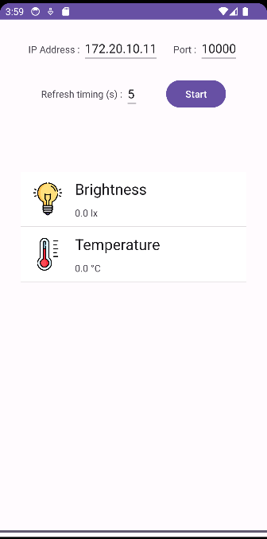
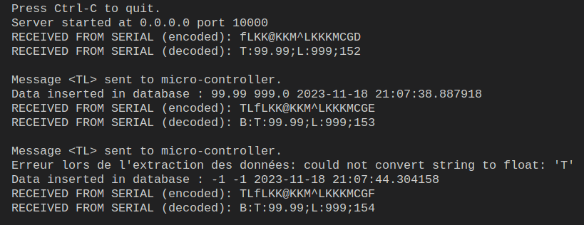
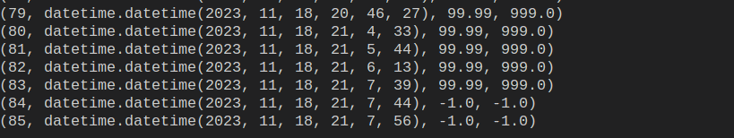
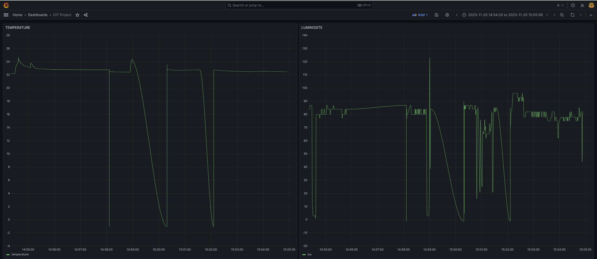

# Projet IoT 

## Participants
* Théo CLERE - Communication Passerelle-Android
* Damien MAILHEBIAU - Communication Passerelle-Serial 
* Maxime DUBOIS - Communication RF
* Sandro SPINA - Communication Passerelle-Android

## Introduction
Ce projet IoT, développé dans le cadre du cours d'IoT à CPE, se concentre sur la collecte et l'affichage des données de température et de luminosité. Il exploite des micro-bits et une application Android, intégrant des mécanismes de communication sécurisée, une gestion efficace des micro-bits, et une infrastructure serveur robuste.

## Protocole de Communication
Pour garantir une communication sécurisée, le projet met en œuvre un protocole incluant les éléments suivants :
* Entête : Les messages distants utilisent l'entête "DMST:" pour filtrer et traiter uniquement les messages pertinents.
* Chiffrement du Corps : Le corps des messages est chiffré à l'aide d'un algorithme de décalage (César).

## Micro-bit 2
* Capteurs : Acquisition de la température et de la luminosité.
* Affichage : Valeurs affichées à l'écran selon un ordre par défaut.
* Modification d'ordre : Possibilité de modifier l'ordre d'affichage lors de la réception d'un ordre RF.

## Application Android
* Configuration : Choix de l'adresse IP/port de la passerelle.
* Timer de Rafraîchissement : Mécanisme de timer pour définir la période de rafraîchissement des données.
* Drag & Drop : Fonctionnalité de glisser-déposer pour inverser l'ordre d'affichage des données.
* Barre de Chargement : Affichage du temps restant avant le prochain rafraîchissement de données.



## Serveur - Passerelle uBit (Serial)
* Attente d'un message de la passerelle.
* Réception et Enregistrement des Données : Enregistrement des données de température et de luminosité dans la base de données, gestion d'erreurs avec valeur -1 en cas de donnée invalide.
* Génération du Timestamp : Le timestamp est généré côté serveur, compte tenu de l'absence d'horloge intégrée dans le micro-bit.
* Gestion de Buffer et Délimiteur : Utilisation d'un buffer et d'un délimiteur pour la réception des données complètes.
* Extraction des Données avec Gestion d'Erreur : Extraction des données avec une gestion d'erreur si la structure n'est pas conforme.
* Classe DatabaseManager : Création d'une classe DatabaseManager pour simplifier la gestion de la base de données.




## uBit (Passerelle) - uBit (Radio)
Attente d'un message du micro-bit distant, réception des données de température et luminosité.
* Vérification de la Validité des Données : Vérification de l'entête et du chiffrement des données reçues.
* Envoi en Série au Serveur : Envoi des données en série au serveur si l'entête est valide.
* Communication pour Changer l'Ordre : Attente d'un message du serveur pour changer l'ordre côté micro-bit distant (TL ou LT).
* Envoi Chiffré au Micro-bit Distant : Envoi chiffré au micro-bit distant si TL ou LT est reçu.

## MySQL / Grafana

* Un Docker compose nous a été utile afin de déployer un container MySQL et un container Grafana.

```sh
docker-compose -f docker-compose-mysql.yaml up -d
```

Lancement de la BDD et de Grafana: 
* MySQL 
user: root
mdp: admin
* Grafana :
localhost:3000
user: admin
mdp: adminadmin


