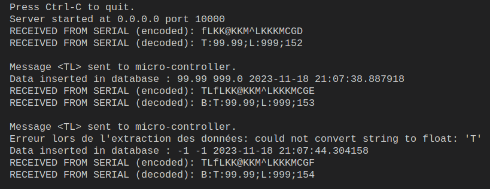
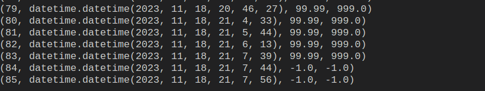
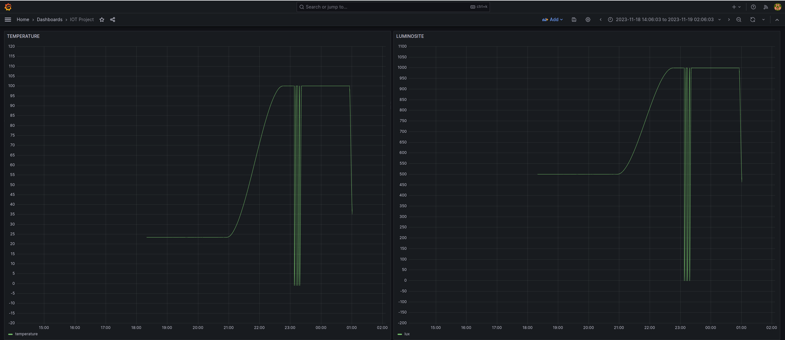

## Damien 
### Serveur - passerelle uBit (serial) 

- Attente d'un message de la passerelle, on reçoit les données de T°C et de luminosité
- Enregistrement des données reçues dans la BDD, avec gestion d'erreurs (-1 si donnée invalide)
- Utilisation d'un buffer et d'un délimiteur pour la réception des données
- Extraction des données reçues avec gestion d'erreur si les données ne sont pas sous la bonne forme.
- Création d'une classe DatabaseManager pour gérer la base de données pour facilement.

### uBit (passerelle) - uBit (radio)

- Attente d'un message du uBit distant, on reçoit les données de T°C et de luminosité
- On vérifie que les données reçues sont valides (header et encryption)
- Si header ok, on envoie en serial au serveur.

- Attente d'un message du serveur, on attend TL ou LT pour changer l'ordre côté uBit distant.
- Si TL ou LT, on envoie encrypté au uBit distant.

### MySQL / Grafana

- Docker compose pour créer un container MySQL et un container Grafana.
- MySQL 
user: root
mdp: admin
- Grafana :
localhost:3000
user: admin
mdp: adminadmin

